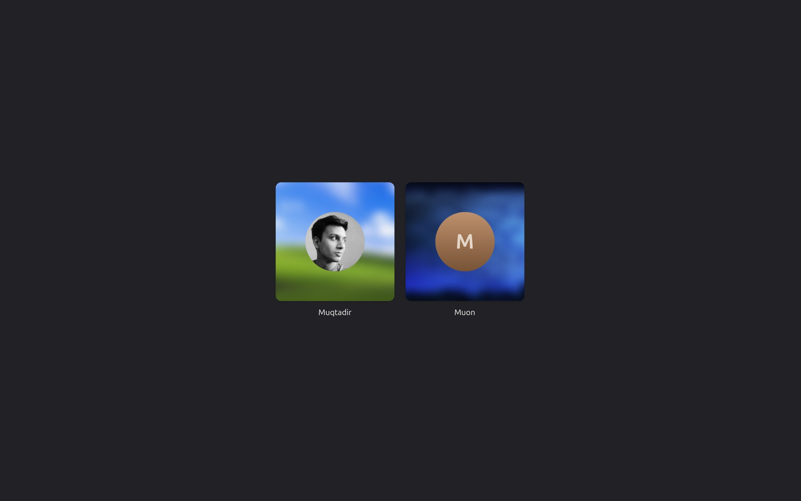
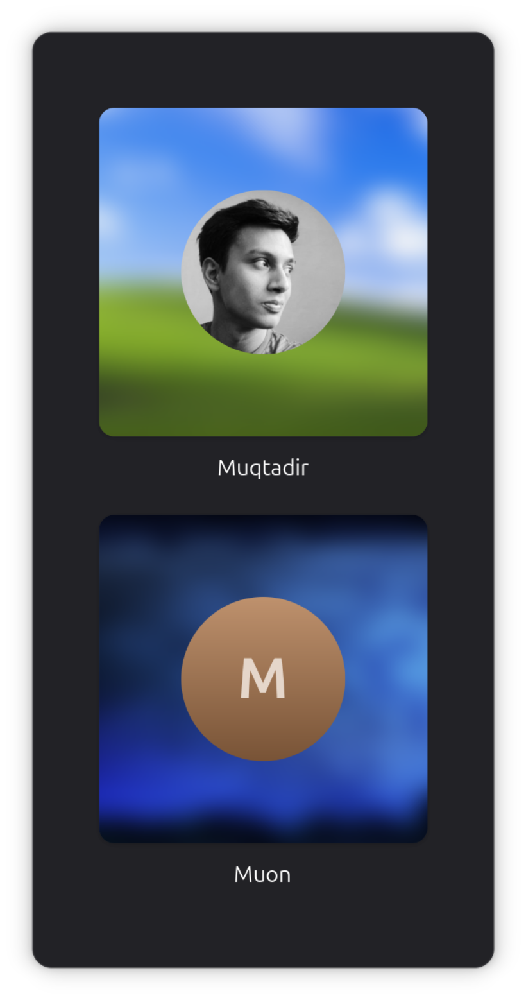
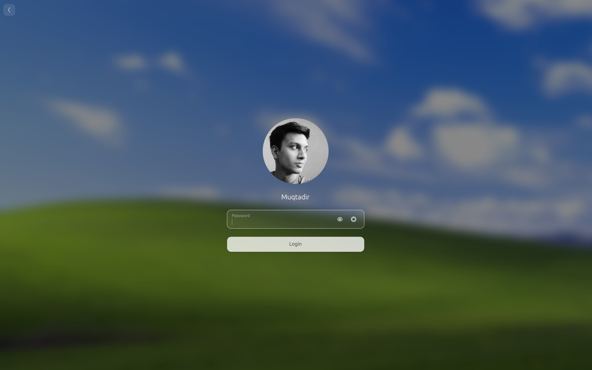
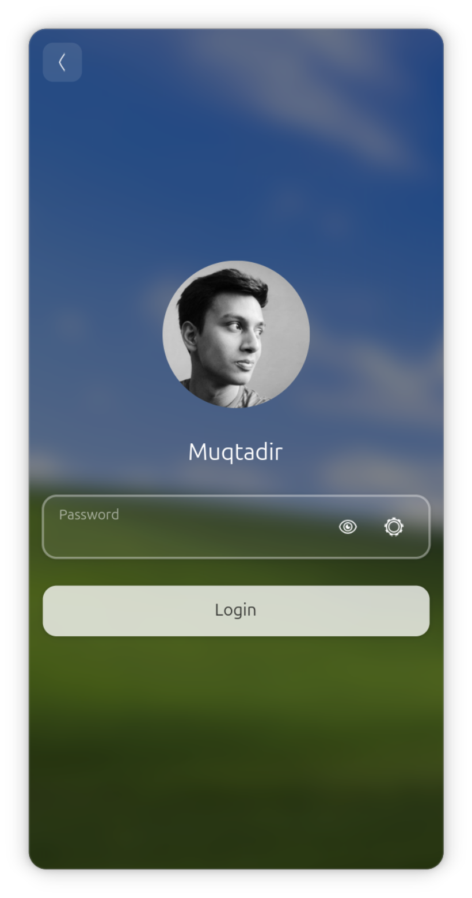

## unity-greeter

greeter for unity-desktop, that drives PAM authentication through `greetd` via `astal-greet`, and hands the session off to `phoc`.

### screenshots

| desktop form-factor| mobile form-factor |
| ------------------ | ------------------ |
|  |  |
|  |  |

### components

- **`UnityGreeter`**: shows the user picker and hosts the login page.
- **`UnityGreeterUser`**: account that can log in. Carries the display name, avatar and last chosen session.
- **`UnityGreeterSession`**: desktop session the user can pick from.
- **`UnityGreeterConversation`**: communicates to greetd by sending the typed password to PAM and reports back what PAM answers.
- **`unity-greeter-idle`**: saves power while the login screen is unattended. Turns the outputs off after 2 minutes of no input. Asks logind to suspend the machine after 3 minutes.
- **Per-user wallpaper**: each user has their own login-screen picture. `unity-shell` writes it before logout. The greeter reads it back on the next login.

### build

install the deps:

- `gtk4` (>= 4.22)
- `libadwaita-1` (>= 1.9)
- `gio-2.0`, `gio-unix-2.0`, `glib-2.0` (>= 2.80)
- `graphene-1.0`,
- `json-glib-1.0`
- `accountsservice` (>= 23.13.9)
- `astal-greet-0.1`,
- `astal-wl-0.1`,
- `unity-platform-quit`,
- `unity-platform-wlr`
- `meson`,
- `ninja`

```sh
meson setup build
ninja -C build
sudo meson install -C build
```
